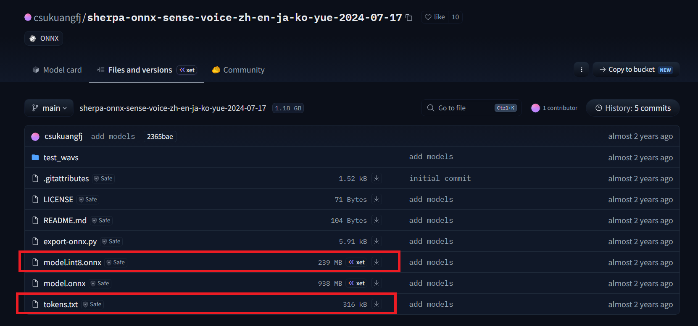

# Impress Voice Input

基于 ONNX 的实时语音转文本输入法，C++ 跨平台实现。

## 功能特性

- **实时语音识别** — 长按快捷键开始录音，松开自动识别并注入文字
- **音频文件转写** — 支持 WAV/MP3/FLAC/OGG，批量处理，导出 TXT/SRT
- **跨平台 GUI** — Qt 6 构建，支持 Windows / Linux
- **本地推理** — SenseVoice ONNX 模型，支持 CPU/GPU 加速
- **可配置** — 模型路径、推理参数、快捷键均可自定义
- **系统托盘** — 最小化后台运行，双击快速唤出

## 快速开始

### 下载安装

| 平台 | 文件 | 大小 |
|------|------|------|
| Windows | `impress_voice_input_windows.zip` | ~47MB |
| Linux | `impress_voice_input_linux.tar.gz` | ~34MB |

- **Windows**：解压后进入 `dist_win/` 目录，双击 `impress_voice_input.exe`
- **Linux**：解压后运行 `./run.sh`

### 首次使用

1. 获取 SenseVoice ONNX 模型（`.onnx` 格式）
2. 打开应用 → 切换到 **配置** 标签页
3. 设置 **模型路径** 指向 `.onnx` 文件
4. 设置 **词表路径** 指向 `tokens.txt` 文件
5. 点击 **保存配置**
6. 设置语音快捷键（默认长按 CapsLock）
7. 状态栏右侧显示 <span style="color:#27ae60">**模型已就绪**</span> 即可开始使用

### 模型下载

本项目使用 **SenseVoice Small** 多语言语音识别模型（支持中文、英文、日语、韩语、粤语）。

1. 访问 HuggingFace 模型仓库：
   [csukuangfj/sherpa-onnx-sense-voice-zh-en-ja-ko-yue-2024-07-17](https://huggingface.co/csukuangfj/sherpa-onnx-sense-voice-zh-en-ja-ko-yue-2024-07-17/tree/main)
2. 下载以下两个文件：
   - **`model.int8.onnx`** — 量化后的 ONNX 模型文件（约 76MB）
   - **`tokens.txt`** — 词元表文件
3. 将文件保存到本地任意目录，在应用 **配置** 页面中分别设置 **模型路径** 和 **词表路径** 指向这两个文件即可。



## 使用说明

### 快捷键

| 功能 | 快捷键 |
|------|--------|
| 语音输入 | 长按 CapsLock 超过 1 秒（可自定义） |
| 使用说明 | F1 |
| 重启应用 | Ctrl+R |
| 退出应用 | Ctrl+Q |

### CapsLock 工作模式

- **短按（< 1 秒）**：正常切换大小写锁定
- **长按（> 1 秒）**：触发语音输入模式，开始录音
- **松开快捷键**：停止录音 → 自动识别 → 文字注入目标应用

### 语音输入流程

1. 在 **配置** 页面中设置正确的 STT 模型路径并保存
2. 设置语音输入快捷键（默认长按 CapsLock）
3. 将光标定位到需要输入文字的目标应用（如微信、Word、浏览器等）
4. 长按快捷键开始说话，说完后松开
5. 识别的文字将自动输入到目标应用中

### 文件转写流程

1. 切换到 **音频文件转写** 标签页
2. 点击 **选择文件** 选择音频文件，支持拖放
3. 点击 **开始转写**，等待处理完成
4. 点击 **复制结果** 复制到剪贴板，或 **导出结果** 保存为文件

### 系统托盘

关闭主窗口时程序最小化到系统托盘，托盘图标菜单支持：

- **显示主窗口**：恢复主窗口显示
- **重启**：重启应用程序
- **退出**：完全退出程序
- 双击托盘图标可快速显示主窗口

### 状态栏

底部状态栏右侧显示 STT 模型加载状态：

- <span style="color:#27ae60">**模型已就绪**</span> — 模型加载成功，可以正常使用
- <span style="color:#e74c3c">**模型路径未设置**</span> — 请在配置页面设置模型路径
- <span style="color:#e67e22">**模型加载失败**</span> — 模型文件路径错误或文件损坏

## 项目结构

```
impress_voice_input/
├── CMakeLists.txt              # 构建配置
├── LICENSE                     # GNU GPLv3 授权文件
├── README.md                   # 项目说明
├── build-linux.sh              # Linux 构建脚本
├── build-win.sh                # Windows 交叉编译 + 打包脚本
├── cmake/                      # CMake 模块
│   └── dependencies.cmake      # 依赖查找
├── src/
│   ├── main.cpp                # 入口
│   ├── app/                    # 应用层 (Application, ConfigManager)
│   ├── core/                   # 核心 (SenseVoiceEngine, AudioProcessor, VoiceInputService)
│   ├── audio/                  # 音频 (AudioCapture, AudioDecoder, RingBuffer)
│   ├── ui/                     # GUI 页面与控件
│   │   ├── main_window.cpp     # 主窗口
│   │   ├── stt_test_page.cpp   # 实时识别页
│   │   ├── file_transcribe_page.cpp  # 文件转写页
│   │   ├── settings_page.cpp   # 配置页
│   │   └── widgets/            # 自定义控件
│   └── utils/                  # 工具类
├── configs/                    # 配置文件
├── models/                     # ONNX 模型存放目录
└── third_party/                # 第三方依赖
```

## 技术栈

| 组件 | 选型 |
|------|------|
| GUI | Qt 6 (Fusion / Windows 原生风格) |
| 推理引擎 | ONNX Runtime (C++ API) |
| 语音模型 | SenseVoice Small |
| 音频采集 | PortAudio |
| 音频解码 | dr_libs (dr_wav, dr_mp3, dr_flac) |
| 构建系统 | CMake 3.20+ |
| 配置存储 | nlohmann/json |

## 编译指南

### 前置依赖

1. **CMake** >= 3.20
2. **Qt 6** >= 6.5
3. **ONNX Runtime** C++ 库
4. **PortAudio**
5. C++17 兼容编译器 (GCC 9+ / Clang 10+ / MSVC 2019+)

### 第三方库准备

```bash
# 放入 third_party/ 目录
third_party/
├── onnxruntime/          (Linux)
├── onnxruntime-win-x64/  (Windows 交叉编译)
├── portaudio/
│   ├── include/
│   └── lib/
└── dr_libs/
    ├── dr_wav.h
    ├── dr_mp3.h
    └── dr_flac.h
```

### Linux 编译

```bash
./build-linux.sh --release
# 可执行文件: build_linux/impress_voice_input
```

### Windows 交叉编译

```bash
./build-win.sh --release
# 输出: build_win/dist_win/ (可直接运行的目录)
#       dist/impress_voice_input_windows.zip (发布压缩包)
```

### 手动编译

```bash
mkdir build && cd build
cmake .. -DCMAKE_BUILD_TYPE=Release
cmake --build . -j$(nproc)
```

### 命令行参数

```bash
# 默认启动
./impress_voice_input

# 指定配置文件
./impress_voice_input --config /path/to/config.json

# 指定模型
./impress_voice_input --model /path/to/model.onnx

# 指定日志目录
./impress_voice_input --log-dir /path/to/logs
```

## 常见问题

**Q: 语音输入没有反应？**
A: 请确认：① 模型已加载（状态栏显示"模型已就绪"）；② 已设置语音快捷键；③ 麦克风正常工作。

**Q: 识别文字没有输入到目标应用？**
A: 某些应用可能拦截模拟按键输入，请尝试在管理员权限下运行本程序。

**Q: 识别速度慢？**
A: 在配置中增大 ONNX 线程数，或使用 GPU 版本的 ONNX Runtime。

**Q: CapsLock 短按不起作用？**
A: 请确保按键时间小于 1 秒，超过 1 秒会触发语音输入模式。

## 当前状态

- [x] 项目结构与 CMake 配置
- [x] 配置管理模块 (线程安全，自动持久化)
- [x] SenseVoice 完整推理 (Fbank → LFR → CMVN → ONNX → CTC 解码)
- [x] Mel 频谱图提取 (Hann 窗 + FFT + Mel 滤波器组)
- [x] Whisper 推理 (自回归解码 + 流式识别)
- [x] 音频采集/解码 (PortAudio/dr_libs)
- [x] 音频重采样 (非 16kHz 自动处理)
- [x] 语音活动检测 (VAD)
- [x] 三个 GUI 页面 (实时识别 / 文件转写 / 配置)
- [x] 批量文件转写 + 结果导出 (TXT / SRT / JSON)
- [x] 日志系统 (控制台 + 文件)
- [x] Windows 全局快捷键 (CapsLock 长按)
- [x] Linux Wayland/X11 快捷键 + 文本注入
- [x] 系统托盘 + 主题切换 (深色/浅色)
- [x] 跨平台打包
- [ ] 单元测试完善
- [ ] macOS 支持

## License

GNU General Public License v3.0 — 详见 [LICENSE](LICENSE) 文件。
